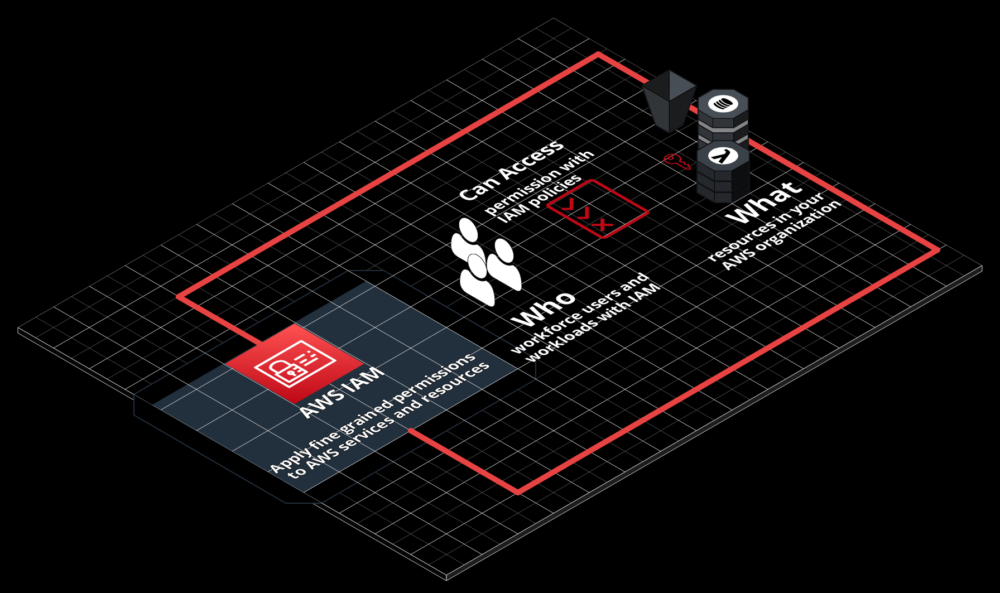
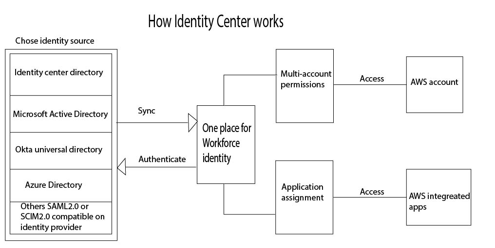

<!-- # Introduction to Cognit

    Overview.
    Why Cognito
    Cognito features
        User pool
        Identity pool
        Role based access control
        Attributes for access control
    Cognito pools
        User pool
        Implementing user pools
        Identity pool
        Implementing Identity pool
        Differences between user pool and identity pool
    Functionality of Cognito
        User Management
        Authentication
        Synchronization across devices
    Advantages of Cognito
    Disadvantages of Cognito
    When to use Cognito

    IAM (Identity Access Management) Previously called SSO

    What it is.
    How it works.
    Why use IAM
    IAM features
    Best practices for security
    Best practices for permissions

    IAM Identity Access Management Center Previously called SSO

    What it is.
    Concept
    How it works.
    Deployment options
    Why use IAM Center
    IAM Center Delegated Administration
    Best practices for security
    Best practices for permissions -->


# Introduction to Amazon Cognito
# Introduction.
Amazon Cognito is a powerful authentication and authorization service that enables developers to secure their applications and manage and authenticate user access to AWS resources. With its advanced features, developers can integrate social identity providers such as Facebook, Google, Amazon, and others. Additionally, Amazon Cognito provides a secure and scalable user directory that integrates with AWS Identity and Access Management (IAM). By choosing Amazon Cognito, developers can focus on the core features of their applications while leaving complex security and identity management to Cognito. This makes it a formidable tool for developers, ensuring that their applications remain safe and secure, even in the face of threats from all sorts of cybercriminals.

# Overview

Amazon cognito is an user identity platform for web and mobile apllications and data synchronization service across multiple devices.
With cognito, you can can authenticate and authorize your application users from built-in user directory, enterprise directory and from consumer identity providers like google, apple, facebook etc.

Amazon Cognito provides an identity store that scales to millions of users, supports social and enterprise identity federation, and offers advanced security features to protect your consumers and business. The two main components of Amazon Cognito are user pools and identity pools.

### Why Amazon Cognito
As a developer, you face an uphill battle when it comes to coding the service to handle and manage user, authentications, authorizations and user data synchronization across multiple devices. But with Amazon Cognito, you can take a load off your mind with just a few configurations in the AWS console. This highly scalable solution is not only effective, but it's also cost-free, freeing you up to focus on creating the best application possible. With Amazon cognito, you can boast of :-
- Enhance Security
- Cross-platform consistency
- Guest and social media login
- MFA and Password policies
- Market analysis with aws pinpoint.

## Features of Amazon Cognito
Amazon cognito has four main features
##### 1). User Pool
##### 2). Identity Pool
##### 3). Role Based Access control (RBAC)
##### 4). Attributes for Acces Control


### User Pool
According to the official AWS documentation:

A user pool is a directory of users in Amazon Cognito. With a user pool, your users can sign in to your web or mobile app through Amazon Cognito ...

This means that an anonymous user of our application (for example, a mobile or single-page application) can complete a registration form and become a registered user. The chosen credentials (i.e. username and password) will be securely stored in the Cognito User Pool .

In this case, Amazon Cognito acts as an Identity Provider (IdP) .

When this registered user wants to log in, the User Pool will be used as the source of truth to assess the authenticity of the supplied credentials; if valid, a JSON Web Token (JWT) will be returned that is used to access resources of the application.


When amazon cognito user pool is implemented in you application, users can be managed from your AWS console account.

Creating a user pool is a great way to manage, authenticate and authorize users on your app or API. With user pools, you have a self-service and administrator-driven user management tool that can act both as an identity provider (IdP) or a service provider (SP) to a workforce or consumer IdP. One benefit of user pools is that they don't require integration with an identity pool - they can issue authenticated JSON web tokens (JWTs) straight to your app, web server, or API.

### Identity Pool
Identity pool comprises of unique identifiers or identities allocated to your users or guests, who are then authorized to retrieve temporary AWS credentials with limited privileges to access other AWS resources. This ensures enhanced security measures and controlled authorization.

<!-- Fine-grained access control. -->
Can be integrated with other identity service providers (IdP).

### Differences between Identity Pool and User Pool

Identity pool helps users to use AWS services.

The identity pool uses the JWT token from the User pool to get AWS Credentials from Cognito and use that to log in and use the application in AWS

**Where as**

The user pool helps users to use mobile and web apps.

It authenticates the credentials given by the user verifies that and gives back a JWT token to the user to access the mobile and web app

#### Core functionalities of amazon cognito
1. User Management
2. Authentication
3. Synchronization Across Devices

#### Strengths of Amazon Cognito
1. Easy to set-up.
2. Simple integration
3. Easy to configure the UserPools, and the Identity Pools.
4. Seamless Integration with AWS services like Lambda, IAM, etc.
5. Cheaper than other providers.
6. Amazon cognito allows you to gather app    users information easily and conviniently.
7. Completely scaled and managed by AWS.
8. A good budget option even for large scale business


#### Weakness's of Amazon Cognito
**1. Disaster Recovery.**

Amazon prides itself on providing world-class security, so much so that its disaster recovery system is extremely poor. Although it is unlikely that Amazon Web Services will ever experience an outage/hack, if it does, then recovering your data will be an unpleasant and challenging task.


**2. Lack of integration with third-party services**

AWS services are amazing, but sometimes for a better solution, developers use other third-party services. Although AWS Cognito can be integrated with them, their integration flow is nowhere as smooth as it is with other AWS services. Hence, it is a significant drawback for us.


## AWS IAM (Identity and Access Management)

This is a web service provided by amazon that helps you to securely control access to your AWS resources. It gives privileges and permissions to users.


### How it works.
 You can specify who can access which service and which resource in AWS, centrally manage fine grained permissions and analyse access to refine permissions across AWS.

<!-- diagram for IAM features cycle set anylyse refine -->

### Why use IAM?
Use IAM to manage and scale workload and workforce access securely supporting your agility and innovation in AWS.

### IAM best Security practices
Two types of identities in IAM: human users and workloads.

- Require human users to use federation with an identity provider to access AWS using temporary credentials
- Require workloads to use temporary credentials with IAM roles to access AWS.
- Require MFA (Multi-Factor Authentication).
- Rotate access key regularly (best for long term credentials).
- Safe guard your users credentials and dont use them for everyday tasks (with the help of AWS guard duty).
  
Security best practices can more efficient with services such **AWS trusted Advisor, IAM access analyzer**

### IAM best permissions practices
- Apply least-privilege permissions (By giving users the least permissions to get a task done).
- Establish permissions guardrails (data perimeter) across multiple accounts.---------------More to add see notebook
- Fine grain access control with conditions.
  
   example of IAM condition

        "condition":{
            "{operator}" :
            {"{key}" : "{value}"}
        }

The capabilities of AWS IAM are extended in Identity Center.

## Identity Center
Identity center extends the capabilites of IAM by providing an interface to centrally manage users, create users and groups in AWS IAM and also provide short term credentials to users and groups.

##### Identity Center have the following characteristics
- One place to create or connect your workforce identity.
- Freedom to choose your prefered identity source for use across AWS.
- Multi-Account permissions to manage fine grained access to AWS resources.
- Application assignments to manage access to IAM identities center enabled and other cloud apps.

### Concept of Identity Center
- User, groups, provisioning
- Identity Provider (user creation, management and authentication).
- SAML and SCIM (Industry standards of passing information between identity provider and service provider or application).
- Permission set. Contains one or more IAM policies that gets applied to one or more AWS accounts
- ABAC. capability that allows athentication based on attributes of an identity or resource
- Entitlement/Assignments
    ```
    AWS account 
     + user or group 
     + permission set
    ```

