# Introduction to Cognito
&nbsp; &nbsp;[Overview.](#overview)

&nbsp; &nbsp;[Why Cognito](#why-amazon-cognito)
&nbsp; &nbsp;[Cognito features](#cognito-features)
<!-- &nbsp; &nbsp;[User pool](#user-pool) -->
<!-- [Identity pool](#identity-pool)
[Role based access control](#role-based-access-control)
[Cognito pools](#cognito-pools)
[Cognito features](#cognito-features)
[Cognito features](#cognito-features)
[Cognito features](#cognito-features) -->
<!--         
        Role based access control
        Attributes for access control -->
&nbsp; &nbsp;[Cognito pools](#amazon-cognito-pools)
&nbsp; &nbsp; &nbsp; [User pool](#user-pool)
&nbsp; &nbsp; &nbsp; &nbsp;  [Creating cognito user pool](#creating-a-cognito-user-pool-in-aws-console)
&nbsp; &nbsp; &nbsp; &nbsp; &nbsp; [Cognito user pool use cases](#when-should-you-use-cognito-user-pool)
        <!-- Implementing user pools -->
       &nbsp; &nbsp; &nbsp; [Identity pool](#identity-pool)
        <!-- Implementing Identity pool -->
&nbsp; &nbsp; [Differences between user pool and identity pool](#differences-between-identity-pool-and-user-pool)
&nbsp; &nbsp; [Cognito Pricing](#amazon-cognito-pricing)
&nbsp; &nbsp; &nbsp; &nbsp;[Free Tier](#free-tier)
&nbsp; &nbsp; &nbsp; &nbsp;[Pricing Tier](#pricing-tier)
&nbsp; &nbsp; [Advantages of Cognito](#strengths-of-amazon-cognito)
&nbsp; &nbsp; [Weaknesses of cognito](#weaknesses-of-amazon-cognito)
&nbsp; &nbsp; [Cognito Sync](#cognito-sync)

[IAM (Identity Access and Management)](#aws-iam-identity-and-access-management)
&nbsp; &nbsp; [Why IAM](#why-use-iam)
&nbsp; &nbsp; [How IAM Works](#how-it-works)
&nbsp; &nbsp; [IAM permision best practices](#iam-best-permissions-practices)
&nbsp; &nbsp; [IAM security best practices](#iam-best-security-practices)
&nbsp; [IAM Identity Center](#identity-center)
&nbsp; &nbsp; &nbsp; [How IAM identity center works](#how-iam-identity-center-works)
<!-- 
    IAM (Identity Access Management) Previously called SSO

    What it is.
    How it works.
    Why use IAM
    IAM features
    Best practices for security
    Best practices for permissions

    IAM Identity Access Management Center Previously called SSO

    What it is.
    Concept
    How it works.
    Deployment options
    Why use IAM Center
    IAM Center Delegated Administration -->


# Introduction to Amazon Cognito
# Introduction.
Amazon Cognito is a powerful authentication and authorization service that enables developers to secure their applications and manage and authenticate user access to AWS resources. With its advanced features, developers can integrate social identity providers such as Facebook, Google, Amazon, and others. Additionally, Amazon Cognito provides a secure and scalable user directory that integrates with AWS Identity and Access Management (IAM). By choosing Amazon Cognito, developers can focus on the core features of their applications while leaving complex security and identity management to Cognito. This makes it a formidable tool for developers, ensuring that their applications remain safe and secure, even in the face of threats from all cybercriminals.

###### Authentication is a delightful process of ensuring that the user is who they say they are.
###### Authorization is giving the right access of resources to the right users

# Overview

Amazon cognito is an user identity platform for web and mobile apllications and data synchronization service across multiple devices.
With cognito, you can authenticate and authorize your application users from built-in user directory, enterprise directory and from consumer identity providers like google, apple, facebook etc.

Amazon Cognito provides an identity store that scales to millions of users, supports social and enterprise identity federation, and offers advanced security features to protect your consumers and business. The two main components of Amazon Cognito are user pools and identity pools.

### Why Amazon Cognito
As a developer, you face an uphill battle when it comes to coding the service to handle and manage user, authentications, authorizations and user data synchronization across multiple devices. But with Amazon Cognito, you can take a load off your mind with just a few configurations in the AWS console. This highly scalable solution is not only effective, but it's also cost-free, freeing you up to focus on creating the best application possible. With Amazon cognito, you can boast of :-
- Enhance Security
- Cross-platform consistency
- Guest and social media login
- MFA and Password policies
- Market analysis with aws pinpoint.
## Features of Amazon Cognito
1. Identity Management
2. User Authentication
3. Access Control
4. Customer Experience
5. Security
6. Data Synchronization Across Devices
## Amazon cognito Pools
 1. User Pool
 2. Identity Pool
<!-- ##### 3). Role Based Access control (RBAC)
##### 4). Attributes for Acces Control -->


## User Pool
According to the official AWS documentation:

A user pool is a directory of users in Amazon Cognito. With a user pool, your users can sign in to your web or mobile app through Amazon Cognito ...

This means that an anonymous user of our application (for example, a mobile or single-page application) can complete a registration form and become a registered user. The chosen credentials (i.e. username and password) will be securely stored in the Cognito User Pool .

In this case, Amazon Cognito acts as an Identity Provider (IdP) .

When this registered user wants to log in, the User Pool will be used as the source of truth to assess the authenticity of the supplied credentials; if valid, a JSON Web Token (JWT) will be returned that is used to access resources of the application.

*User Pools deal with **authentication***


When amazon cognito user pool is implemented in you application, users can be managed from your AWS console account.

#### Creating a Cognito User Pool In AWS console

To create a user pool in aws console, we have 7 main steps that we will go through.

##### Step 1.

Login to your AWS account and in the search bar, type **Cognito** click on Amazon cognito. A screen similar to the one below will be loaded

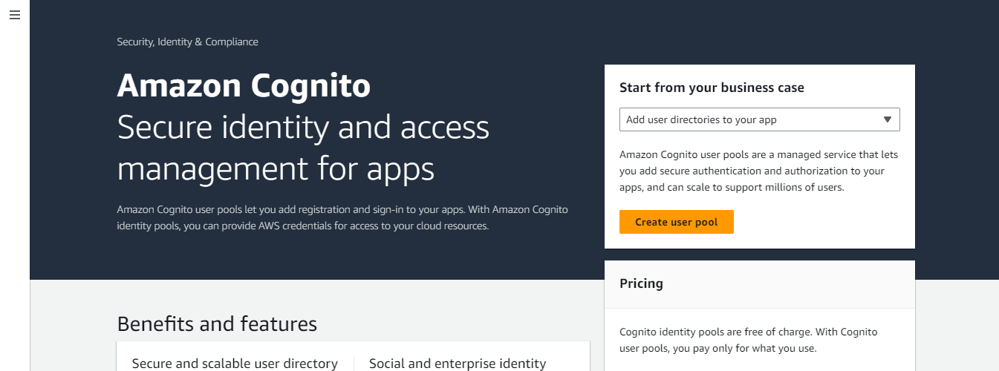

##### Step 2.
**Configure sign-in experience**

Your app users can sign in to your user pool with a user name and password, or sign in with a third-party identity provider.
***Authentication Providers***

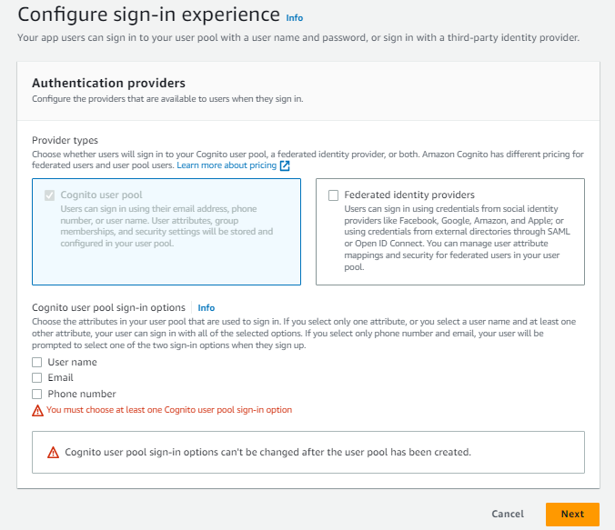

If you check the "Federated Indentity provider", you will have to select you identity provider.

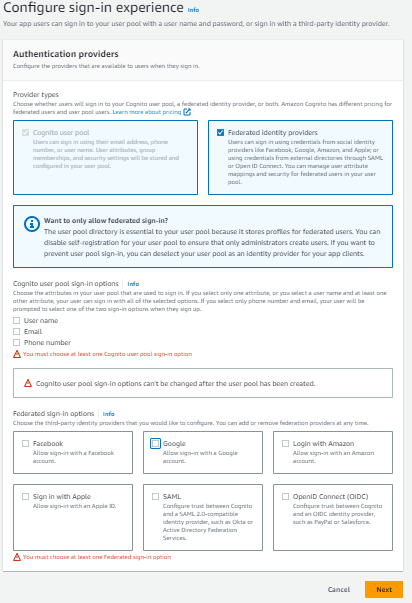

Choose the attributes in your user pool that are used to sign in. If you select only one attribute, or you select a user name and at least one other attribute, your user can sign in with all of the selected options. If you select only phone number and email, your user will be prompted to select one of the two sign-in options when they sign up.

When you are done hit the **Next** button.


##### Step 2. Configure security requirements

Set up a strong password requirement in addition to multi-factor authentication to protect your app users from accidentally compromising their credentials.

***Password policy***

Create policies or requirements for your password. you can use the default or customize it to suite what you want.

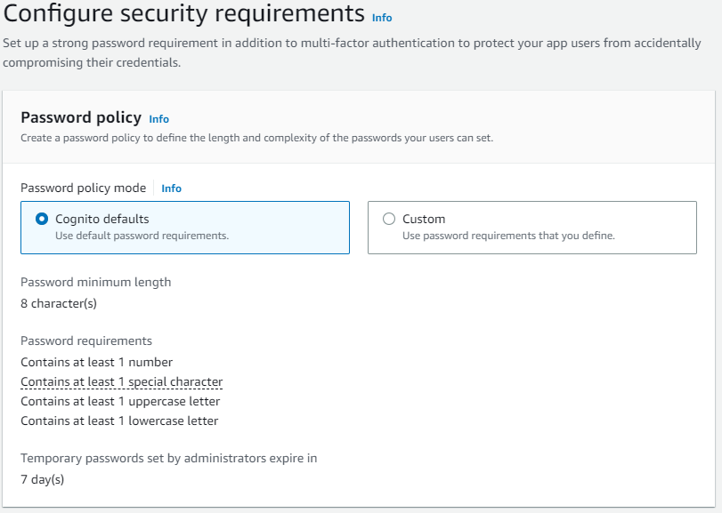


***Multi-factor authentication***
Configure secure access to your app by enforcing multi-factor authentication (MFA) during the user sign-in process. This helps to confirm and validate user emails and phone numbers.

This feature is not compulsory when using cognito. You can chose **No MFA**, **Optional MFA** ( Available if the user provides the info) or **Required MFA** (Where users must provide and valide info e.g email or phone, that can be used for MFA).

**MFA methods**
1. Authenticator apps: 
Users can authenticate with a TOTP(Time-based One-Time Password) from an authenticator app such as Authy or Google Authenticator.

2. SMS message
Users can authenticate with a code sent by SMS message to a verified phone number. SMS messages are charged separately by Amazon SNS (Simple Notification Service).


***User account recovery***
Configure how users will recover their account when they forget their password. Recipient message and data rates apply.

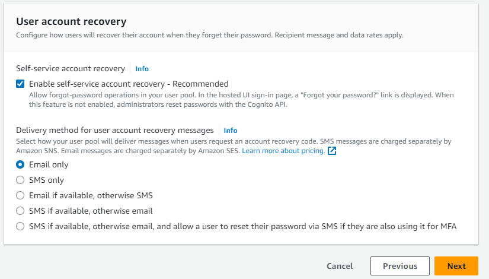

Click **Next** once you are okay with the settings.


##### Step 3. Configure sign-up experience.
Determine how new users will verify their identities when signing up and which attributes should be required or optional during the user sign-up flow.
***Self-Service sign-up***
Choose whether new users can register account for themselves or not.


***Attribute verification and user account confirmation***

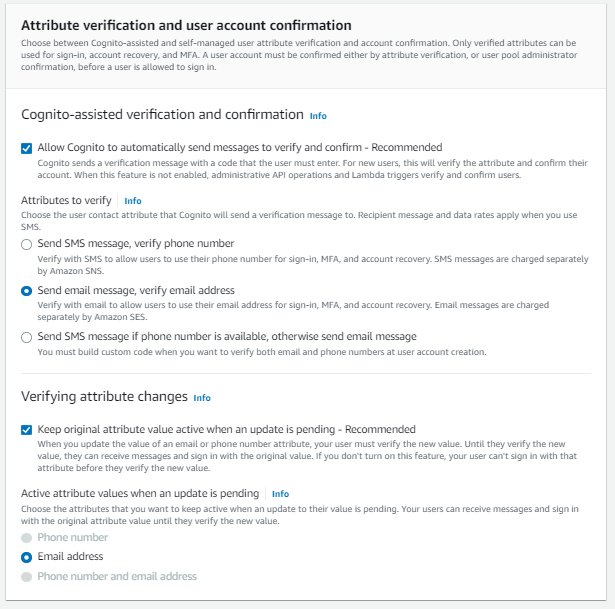

***Required Attributes***
Provide required attributes for your user sign-up.

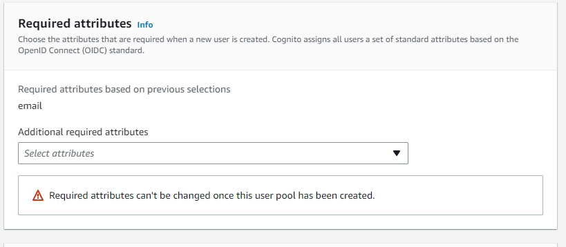

More custom attributes can be added to your user pool.

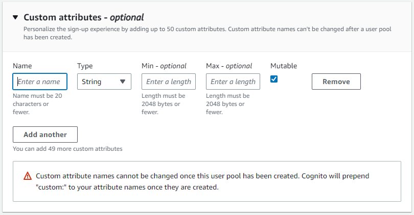

##### step 4. Configure message delivery
Choose send email with cognito since this is an introduction to cognito. This allows cognito to email to users with code the validate/confirm their account creation.


Click the **Next** button.

##### Step 5. Integrate your appInfo
Set up app integration for your user pool with Cognito's built-in authentication and authorization flows.

provide the user pool name.

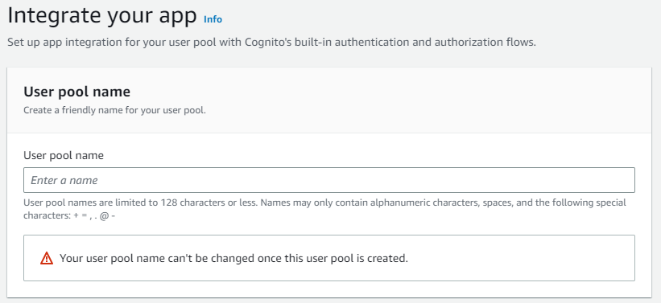

select hosted UI. 


Select **use cognito domain** and add a prefix to the provided domain.

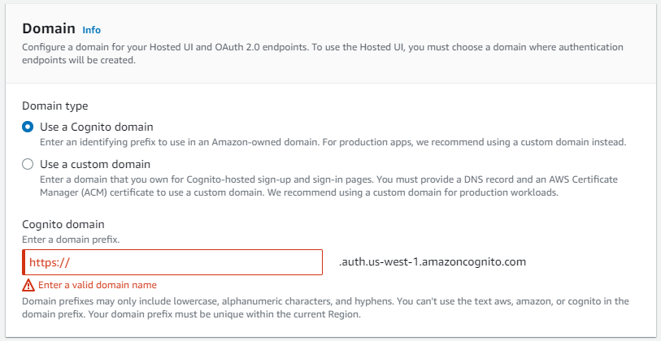


***Initial app client***
Configure an app client. App clients are single-app platforms in your user pool that have permissions to call unauthenticated API operations. A user pool can have multiple app clients. Here you have to provide the app client name and the callback url that the app will redirect to after authentication.

.

Click **Next** when done.

##### Step 7. Review your changes and click Create.

At this point you are done with your user pool creation. Navigate to user pools and click on the name of the user pool you created

<!-- Creating a user pool is a great way to manage, authenticate and authorize users on your app or API. With user pools, you have a self-service and administrator-driven user management tool that can act both as an identity provider (IdP) or a service provider (SP) to a workforce or consumer IdP. One benefit of user pools is that they don't require integration with an identity pool - they can issue authenticated JSON web tokens (JWTs) straight to your app, web server, or API. -->

##### When should you use Cognito User Pool?

***Use case 1***: If you have a backend services (e.g. Spring boot based REST APIs hosted on EC2) that is already having authorisation support, you can use Cognito user pool as authentication provider.

***User case 2***: If you have a web application or mobile that requires user identity to personalise their experience.

## Identity Pool
Identity pool comprises of unique identifiers or identities allocated to your users or guests, who are then authorized to retrieve temporary AWS credentials with limited privileges to access other AWS resources. This ensures enhanced security measures and controlled authorization.

Fine-grained access control.

Can be integrated with other identity service providers (IdP).

### Differences between Identity Pool and User Pool

Identity pool helps users to use AWS services.

The identity pool uses the JWT token from the User pool to get AWS Credentials from Cognito and use that to log in and use the application in AWS.

Focuses more on authorization.

**Where as**

The user pool helps users to use mobile and web apps.

It authenticates the credentials given by the user verifies that and gives back a JWT token to the user to access the mobile and web app.

Focuses on user athentication.


## Amazon Cognito Pricing

##### Free Tier
The Cognito Your User Pool feature has a free tier of 50,000 MAUs per account for users who sign in directly to Cognito User Pools and 50 MAUs for users federated through SAML 2.0 based identity providers. The free tier does not automatically expire at the end of your 12 month AWS Free Tier term, and it is available to both existing and new AWS customers indefinitely. Please note - the free tier pricing isn’t available for both Your User Pool feature and SAML or OIDC federation in the AWS GovCloud regions.
##### Pricing Tier

| Pricing Tier            | (MAUs)	Price per MAU|
|-------------------------|----------------------|
| 50,001-100,000 (after the 50,000 free tier)                     | 	$0.0055         |
| Next 900,000            |	$0.0046             |
| Next 9,000,000          |	$0.00325            |
| Greater than 10,000,000 |	$0.0025             |

## Cognito Sync
Sync charges are based on the total amount of data saved in the Amazon Cognito sync store and the number of sync operations performed. A sync operation compares the local data store on a device to the Amazon Cognito sync store in the cloud and synchronizes the two data stores. As part of the AWS Free Tier, eligible AWS customers receive 10 GB of cloud sync store and 1,000,000 sync operations per month for the first 12 months.

#### Strengths of Amazon Cognito
1. Easy to set-up.
2. Simple integration
3. Easy to configure the UserPools, and the Identity Pools.
4. Free for 50,000 request done daily
5. Seamless Integration with AWS services like Lambda, IAM, etc.
6. Cheaper than other providers.
7. Amazon cognito allows you to gather app    users information easily and conviniently.
8. Completely scaled and managed by AWS.
9. A good budget option even for large scale business


#### Weakness's of Amazon Cognito
**1. Disaster Recovery.**

Amazon prides itself on providing world-class security, so much so that its disaster recovery system is extremely poor. Although it is unlikely that Amazon Web Services will ever experience an outage/hack, if it does, then recovering your data will be an unpleasant and challenging task.


**2. Lack of integration with third-party services**

AWS services are amazing, but sometimes for a better solution, developers use other third-party services. Although AWS Cognito can be integrated with them, their integration flow is nowhere as smooth as it is with other AWS services. Hence, it is a significant drawback for us.


# AWS IAM Identity and Access Management

This is a web service provided by amazon that helps you to securely control access to your AWS resources. It gives privileges and permissions to users.

### How it works.
 You can specify who can access which service and which resource in AWS, centrally manage fine grained permissions and analyse access to refine permissions across AWS.

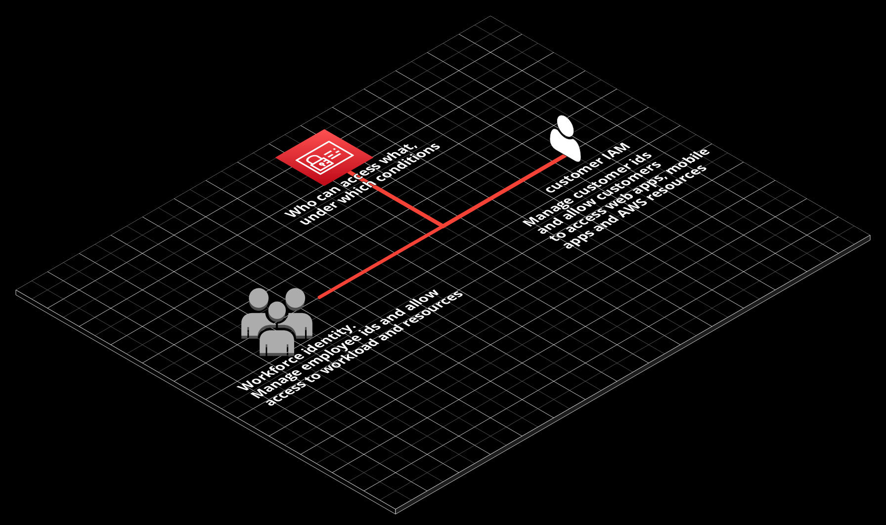

IAM features cycle 
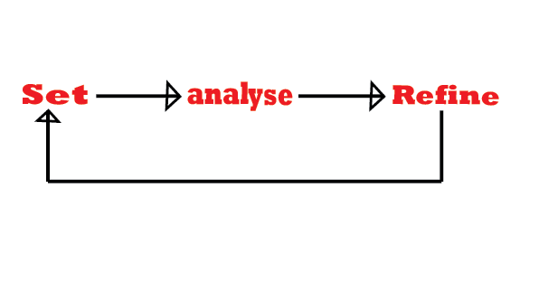
set anylyse refine
### Why use IAM?
Use IAM to manage and scale workload and workforce access securely supporting your agility and innovation in AWS.

#### IAM best Security practices
Two types of identities in IAM: human users and workloads.

- Require human users to use federation with an identity provider to access AWS using temporary credentials
- Require workloads to use temporary credentials with IAM roles to access AWS.
- Require MFA (Multi-Factor Authentication).
- Rotate access key regularly (best for long term credentials).
- Safe guard your users credentials and dont use them for everyday tasks (with the help of AWS guard duty).
  
Security best practices can more efficient with services such **AWS trusted Advisor, IAM access analyzer**

#### IAM best permissions practices
- Apply least-privilege permissions (By giving users the least permissions to get a task done).
- Establish permissions guardrails (data perimeter) across multiple accounts. More to add see notebook
- Fine grain access control with conditions.
  
   example of IAM condition

        "condition":{
            "{operator}" :
            {"{key}" : "{value}"}
        }

The capabilities of AWS IAM are extended in Identity Center.

## Identity Center
Identity center extends the capabilites of IAM by providing an interface to centrally manage users, create users and groups in AWS IAM and also provide short term credentials to users and groups.

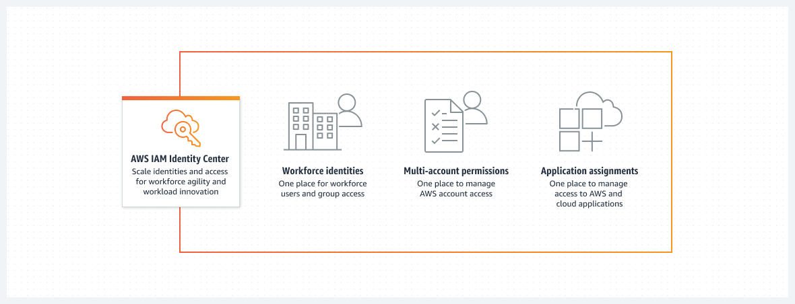.

##### Identity Center characteristics
- One place to create or connect your workforce identity.
- Freedom to choose your prefered identity source for use across AWS.
- Multi-Account permissions to manage fine grained access to AWS resources.
- Application assignments to manage access to IAM identities center enabled and other cloud apps.

### Concept of Identity Center
- User, groups, provisioning
- Identity Provider (user creation, management and authentication).
- SAML (Security Assertion Markup Language) and SCIM (Industry standards of passing information between identity provider and service provider or application).
- Permission set. Contains one or more IAM policies that gets applied to one or more AWS accounts
- ABAC (attribute based access control). capability that allows athentication based on attributes of an identity or resource
- Entitlement/Assignments
    ```
    AWS account 
     + user or group 
     + permission set
    ```

### Features of IAM Identity Center.
1. Centralized identity management
2. Fine-grained permissions and assignments
3. Administrative and governance features

For more on IAM Adentity features, click [here](https://aws.amazon.com/iam/identity-center/features/)

### How IAM Identity Center Works.
.

For more about IAM identity center click [here](https://aws.amazon.com/iam/identity-center/faqs/)